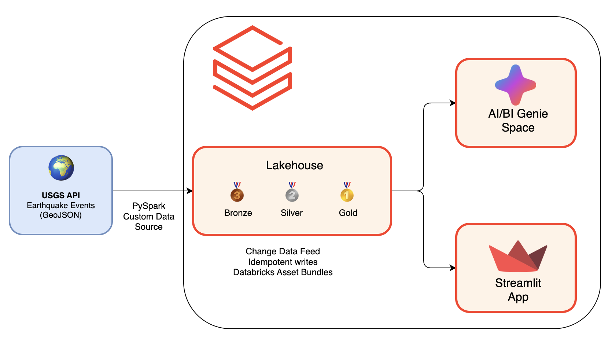

# QuakeLake - Earthquake Analytics Platform

An end-to-end data engineering project on Databricks demonstrating a complete analytics platform - from raw API ingestion, through medallion architecture ETL, to a deployed Databricks App and AI-ready Genie space.


---

## About the Author

**Malvik Vaghadia** - Data Engineering Instructor & Consultant

- [LinkedIn](https://www.linkedin.com/in/malvik-vaghadia/)


### Databricks Courses on Udemy

If you're looking to deepen your Databricks knowledge, check out my courses:

- [CI/CD with Databricks Asset Bundles](https://www.udemy.com/course/cicd-with-databricks-asset-bundles/?referralCode=D7CC9D7AF4003300A457)
- [Azure Databricks and Spark SQL Python](https://www.udemy.com/course/azure-databricks-and-spark-sql-python/?referralCode=C61A322D26568C4E5755)
- [dbt on Databricks](https://www.udemy.com/course/dbt-on-databricks/?referralCode=DBF2E8D7E42E2E63E261)
- [Databricks SQL for Data Analysts](https://www.udemy.com/course/databricks-sql-for-data-analysts/?referralCode=78C6FFDBE3A7474B9607)

---

## Project Overview

This project demonstrates how to build a production-ready analytics platform on Databricks using real-time earthquake data from the USGS API.

### What You'll Learn

1. **End-to-End ETL Pipeline** - Medallion architecture (Bronze → Silver → Gold) with incremental processing using Delta Lake Change Data Feed (CDF)

2. **Databricks App Deployment** - A Streamlit dashboard with 3D interactive globe visualisation, deployed as a Databricks App

3. **AI-Ready Platform** - Structured data ready for AI/BI Genie spaces, enabling natural language queries

### Architecture



**Data Flow:**
1. **USGS API** → PySpark Custom Data Source fetches earthquake events in parallel
2. **Bronze Layer** → Raw GeoJSON data stored in Delta format with CDF enabled
3. **Silver Layer** → Cleansed, deduplicated, and enriched with significance categories
4. **Gold Layer** → Analytics-ready aggregations (map data, daily summaries, regional summaries)
5. **Consumption** → Databricks App (Streamlit 3D visualization) + AI/BI Genie (natural language queries)

---

## Prerequisites

### Skills Required

Before starting this project, you should be comfortable with:

- **Databricks** - Familiarity with the platform
- **Python** - Intermediate level (functions, classes, data structures)
- **SQL** - Intermediate level (JOINs, aggregations, window functions)
- **Spark Basics** - Understanding of DataFrames, transformations, and actions
- **Delta Lake Fundamentals** - ACID transactions, time travel, schema evolution
- **IDE** - Visual Studio Code, PyCharm etc.
- **Git** - Basic version control operations

### Nice to Have
- Familiarity with Streamlit

### Infrastructure Requirements

| Requirement | Details |
|-------------|---------|
| **Databricks Account** | [Databricks Free Edition](https://www.databricks.com/learn/free-edition) (free) or any Databricks workspace |
| **IDE** | VS Code, Cursor, or PyCharm with Databricks extension |
| **Python** | 3.11+ |
| **Package Manager** | [uv](https://docs.astral.sh/uv/getting-started/installation/) (recommended) or pip |
| **Databricks CLI** | v0.200+ ([installation guide](https://docs.databricks.com/dev-tools/cli/databricks-cli.html)) |

---

## Project Structure

```
earthquake_analytics/
├── etl/                          # ETL notebooks (medallion architecture)
│   ├── 01_raw_ingestion.ipynb    # Bronze: API → raw_events
│   ├── 02_silver_transformation.ipynb  # Silver: Cleansing & enrichment
│   └── 03_gold_aggregation.ipynb # Gold: Analytics-ready tables
├── streamlit_app/                # Databricks App
│   └── app.py                    # 3D earthquake visualisation dashboard
├── utils/                        # Shared Python utilities
│   ├── helpers.py                # Catalog, write, CDF, metadata functions
│   └── datasource.py             # USGS API datasource registration
├── resources/                    # Databricks Asset Bundle configs
├── fixtures/                     # Test data
├── databricks.yml                # Bundle configuration
└── pyproject.toml                # Python dependencies
```

---

## Getting Started

### 1. Clone the Repository

```bash
git clone https://github.com/your-username/earthquake_analytics.git
cd earthquake_analytics
```

### 2. Install Dependencies

Using uv (recommended):
```bash
uv sync --dev
```

Or using pip:
```bash
pip install -e ".[dev]"
```

### 3. Configure Databricks Connection

#### Option A: Databricks CLI (Recommended)

```bash
databricks configure
```

You'll be prompted for:
- **Databricks Host**: Your workspace URL (e.g., `https://adb-1234567890.12.azuredatabricks.net`)
- **Personal Access Token**: Generate from User Settings → Developer → Access Tokens

#### Option B: Environment Variables

**macOS/Linux** (using zsh or bash):
```bash
export DATABRICKS_HOST="https://your-workspace.cloud.databricks.com"
export DATABRICKS_TOKEN="your-personal-access-token"
```

**Windows** (using Git Bash):
```bash
export DATABRICKS_HOST="https://your-workspace.cloud.databricks.com"
export DATABRICKS_TOKEN="your-personal-access-token"
```

**Windows** (using PowerShell):
```powershell
$env:DATABRICKS_HOST="https://your-workspace.cloud.databricks.com"
$env:DATABRICKS_TOKEN="your-personal-access-token"
```

#### Verify Connection

```bash
databricks workspace list /
```

### 4. Configure Project Settings

Update the following for your environment:

#### databricks.yml

Update the workspace host URL in `databricks.yml`:

```yaml
workspace:
  host: https://your-workspace.cloud.databricks.com
```

#### streamlit_app/app.yaml

Update the SQL Warehouse ID in `app.yml`:

```yaml
env:
  - name: 'DATARICKS_WAREHOUSE_ID'
    value: 'your-databricks-sql-warehouse-id'
```

### 5. Deploy to Databricks

**Development deployment:**
```bash
databricks bundle deploy --target dev
```

**Production deployment:**
```bash
databricks bundle deploy --target prod
```

### 6. Run the ETL Pipeline

```bash
databricks bundle run earthquake_etl_job
```

Or run notebooks individually from the Databricks workspace.

### 7. Launch the Streamlit App

The app is deployed automatically with the bundle. Access it from your Databricks workspace under **Apps**.

---

## Configuration

### Environment Variables

| Variable | Description | Default |
|----------|-------------|---------|
| `DATABRICKS_HOST` | Workspace URL | - |
| `DATABRICKS_TOKEN` | Personal access token | - |
| `DATABRICKS_WAREHOUSE_ID` | SQL Warehouse ID for Streamlit app | - |
| `CATALOG` | Unity Catalog name | `quake_lake` |
| `SCHEMA` | Schema name | `usgs_earthquakes_dev` |

### Customising the Pipeline

Edit the widget parameters in the ETL notebooks:

- **Catalog/Schema**: Target location for tables
- **Write Mode**: `merge` (incremental) or `overwrite` (full refresh)

### Permissions

For the Streamlit app to query the gold tables, ensure your user or service principal has the following Unity Catalog permissions:

```sql
-- Grant catalog access
GRANT USE CATALOG ON CATALOG <your-catalog> TO `<user-or-group>`;

-- Grant schema access
GRANT USE SCHEMA ON SCHEMA <your-catalog>.<your-schema> TO `<user-or-group>`;

-- Grant read access to gold tables
GRANT SELECT ON TABLE <your-catalog>.<your-schema>.gold_events_map TO `<user-or-group>`;
GRANT SELECT ON TABLE <your-catalog>.<your-schema>.gold_daily_summary TO `<user-or-group>`;
GRANT SELECT ON TABLE <your-catalog>.<your-schema>.gold_regional_summary TO `<user-or-group>`;
```

Alternatively, grant SELECT on all tables in the schema:

```sql
GRANT SELECT ON SCHEMA <your-catalog>.<your-schema> TO `<user-or-group>`;
```

---

## Key Features

### Incremental Processing with CDF

The pipeline uses Delta Lake Change Data Feed for efficient incremental processing:

```python
# Only reads new/changed records since last run
df, version, is_incremental = read_incremental_or_full(
    spark, source_table, checkpoint_table
)
```

### Significance-Based Analysis

Uses USGS significance score (0-1000+) instead of magnitude for more consistent event classification:

| Significance | Category | Colour |
|-------------|----------|--------|
| 600+ | Severe | 🔴 Red |
| 400-599 | Major | 🟠 Orange |
| 200-399 | Moderate | 🟡 Yellow |
| 100-199 | Minor | 🟢 Green |
| <100 | Low | 🔵 Cyan |

### 3D Visualisation

Interactive globe with earthquake columns sized by significance score.

---

## AI/BI Genie Space

Once the gold tables are populated, create a Genie space in Databricks:

1. Navigate to **AI/BI** → **Genie Spaces**
2. Create a new space and connect to your gold tables
3. Ask natural language questions like:
   - *"What regions had the most high-significance earthquakes last month?"*
   - *"Show me the trend of daily earthquake counts"*
   - *"Which day had the highest maximum significance?"*

---

## Resources

- [Databricks Documentation](https://docs.databricks.com/)
- [Delta Lake Documentation](https://docs.delta.io/)
- [USGS Earthquake API](https://earthquake.usgs.gov/fdsnws/event/1/)
- [Streamlit Documentation](https://docs.streamlit.io/)

---

## License

This project is for educational purposes. Feel free to use and modify for your own learning.

---

## Support

If you found this project helpful, consider:

- ⭐ Starring this repository
- 📚 Checking out my [Udemy courses](https://www.udemy.com/user/malvik-vaghadia/)
- 🔗 Connecting on [LinkedIn](https://www.linkedin.com/in/malvik-vaghadia/)
